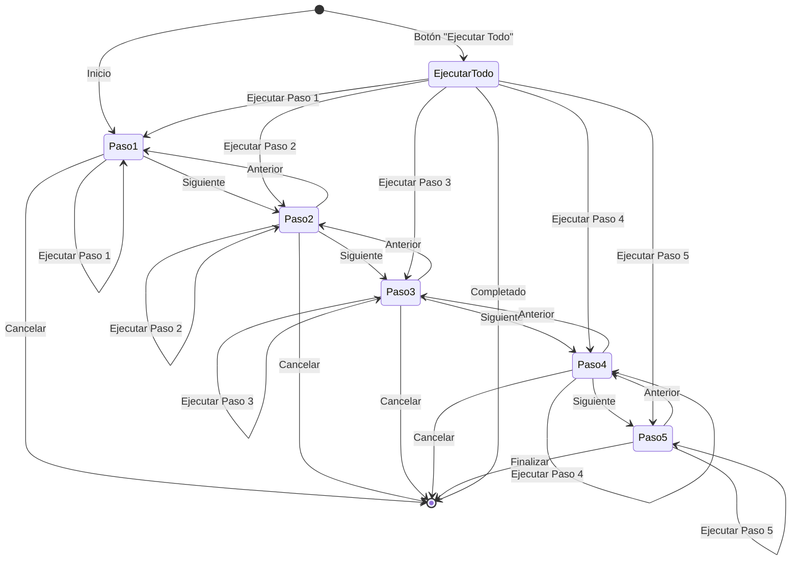
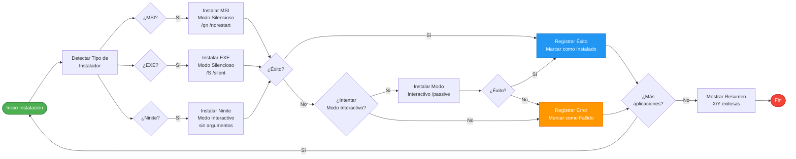

# 🔄 Diagrama de Flujo - MAB APP TECNOLOGIA

## 📊 Flujo Principal de la Aplicación

```mermaid
flowchart TD
    Start([Inicio de la Aplicación]) --> CheckAdmin{¿Ejecutando como<br/>Administrador?}
    CheckAdmin -->|No| ErrorAdmin[Mostrar Error:<br/>Se requieren permisos<br/>de Administrador]
    ErrorAdmin --> End([Fin])
    
    CheckAdmin -->|Sí| Init[Inicializar Aplicación]
    Init --> LoadData[Cargar Datos Iniciales]
    
    LoadData --> LoadConsorcios[Cargar Consorcios desde CSV]
    LoadData --> GetSystemInfo[Obtener Serial y Fabricante<br/>del Equipo]
    LoadData --> ScanSoftware[Escanear Carpeta Software<br/>para detectar aplicaciones]
    LoadData --> EnsureResources[Verificar/Copiar Recursos<br/>a C:\MAB-Resources]
    
    LoadConsorcios --> CheckData{¿Datos cargados<br/>correctamente?}
    GetSystemInfo --> CheckData
    ScanSoftware --> CheckData
    EnsureResources --> CheckData
    
    CheckData -->|Error| ShowError[Mostrar Error y<br/>Registrar en Log]
    ShowError --> End
    
    CheckData -->|OK| Step1[PASO 1: NOMENCLATURA]
    
    Step1 --> ShowStep1[Mostrar Interfaz Paso 1]
    ShowStep1 --> SelectConsorcio[Usuario selecciona Consorcio]
    SelectConsorcio --> SelectTipoEquipo[Usuario selecciona Tipo de Equipo]
    SelectTipoEquipo --> GenerateName[Generar Nombre de Equipo<br/>SIGLAS-XXXX / SIGLAS-RUB-XXXX / SIGLAS-HOME-XXXX]
    GenerateName --> ShowGeneratedName[Mostrar Nombre Generado]
    
    ShowGeneratedName --> ExecuteStep1{¿Ejecutar<br/>Paso 1?}
    ExecuteStep1 -->|No| Navigate1{¿Navegar a<br/>otro paso?}
    Navigate1 -->|Siguiente| Step2
    Navigate1 -->|Anterior| Step1
    
    ExecuteStep1 -->|Sí| RenameComputer[Renombrar Equipo]
    RenameComputer --> CheckRename{¿Renombrado<br/>exitoso?}
    CheckRename -->|Error| LogError1[Registrar Error en Log]
    LogError1 --> ShowError1[Mostrar Error al Usuario]
    ShowError1 --> Step1
    
    CheckRename -->|Éxito| LogSuccess1[Registrar Éxito en Log]
    LogSuccess1 --> Step2[PASO 2: GESTIÓN DE USUARIOS]
    
    Step2 --> ShowStep2[Mostrar Interfaz Paso 2]
    ShowStep2 --> ExecuteStep2{¿Ejecutar<br/>Paso 2?}
    ExecuteStep2 -->|No| Navigate2{¿Navegar a<br/>otro paso?}
    Navigate2 -->|Siguiente| Step3
    Navigate2 -->|Anterior| Step1
    
    ExecuteStep2 -->|Sí| ConfigAdmin[Configurar Usuario ADMIN:<br/>- Renombrar usuario actual<br/>- Configurar contraseña<br/>- Configurar PIN]
    ConfigAdmin --> CheckAdminConfig{¿Configuración<br/>exitosa?}
    CheckAdminConfig -->|Error| LogError2[Registrar Error]
    LogError2 --> ShowError2[Mostrar Error]
    ShowError2 --> Step2
    
    CheckAdminConfig -->|Éxito| CreateMAB[Crear Usuario MAB<br/>estándar sin contraseña]
    CreateMAB --> CheckMAB{¿Usuario MAB<br/>creado?}
    CheckMAB -->|Error| LogError2
    CheckMAB -->|Éxito| LogSuccess2[Registrar Éxito]
    LogSuccess2 --> Step3[PASO 3: PERSONALIZACIÓN]
    
    Step3 --> ShowStep3[Mostrar Interfaz Paso 3]
    ShowStep3 --> ExecuteStep3{¿Ejecutar<br/>Paso 3?}
    ExecuteStep3 -->|No| Navigate3{¿Navegar a<br/>otro paso?}
    Navigate3 -->|Siguiente| Step4
    Navigate3 -->|Anterior| Step2
    
    ExecuteStep3 -->|Sí| PersonalizeAdmin[Aplicar Personalización ADMIN:<br/>- Fondo de pantalla<br/>- Pantalla de bloqueo<br/>- Imagen de perfil]
    PersonalizeAdmin --> PersonalizeMAB[Aplicar Personalización MAB:<br/>- Fondo de pantalla<br/>- Pantalla de bloqueo<br/>- Imagen de perfil]
    PersonalizeMAB --> CheckPersonalization{¿Personalización<br/>exitosa?}
    CheckPersonalization -->|Error Parcial| LogWarning3[Registrar Advertencia]
    LogWarning3 --> Step3
    CheckPersonalization -->|Éxito| LogSuccess3[Registrar Éxito]
    LogSuccess3 --> Step4[PASO 4: INSTALACIÓN DE SOFTWARE]
    
    Step4 --> ShowStep4[Mostrar Interfaz Paso 4<br/>con Lista de Software Detectado]
    ShowStep4 --> SelectSoftware[Usuario selecciona<br/>aplicaciones a instalar]
    SelectSoftware --> ExecuteStep4{¿Ejecutar<br/>Instalación?}
    ExecuteStep4 -->|No| Navigate4{¿Navegar a<br/>otro paso?}
    Navigate4 -->|Siguiente| Step5
    Navigate4 -->|Anterior| Step3
    
    ExecuteStep4 -->|Sí| InstallLoop[Para cada aplicación seleccionada:]
    InstallLoop --> DetectType{¿Tipo de<br/>instalador?}
    DetectType -->|MSI| InstallMSI[Instalar MSI modo silencioso]
    DetectType -->|EXE| InstallEXE[Instalar EXE modo silencioso]
    DetectType -->|Ninite| InstallNinite[Instalar Ninite modo interactivo]
    
    InstallMSI --> CheckInstall{¿Instalación<br/>exitosa?}
    InstallEXE --> CheckInstall
    InstallNinite --> CheckInstall
    
    CheckInstall -->|Error| TryInteractive{¿Intentar modo<br/>interactivo?}
    TryInteractive -->|Sí| InstallInteractive[Instalar modo interactivo]
    InstallInteractive --> CheckInstall
    TryInteractive -->|No| LogInstallError[Registrar Error]
    LogInstallError --> NextApp{¿Más<br/>aplicaciones?}
    
    CheckInstall -->|Éxito| LogInstallSuccess[Registrar Éxito]
    LogInstallSuccess --> NextApp
    
    NextApp -->|Sí| InstallLoop
    NextApp -->|No| ShowInstallSummary[Mostrar Resumen:<br/>X/Y instalaciones exitosas]
    ShowInstallSummary --> Step5[PASO 5: OPTIMIZACIÓN]
    
    Step5 --> ShowStep5[Mostrar Interfaz Paso 5<br/>con Opciones de Optimización]
    ShowStep5 --> SelectOptimizations[Usuario selecciona<br/>módulos de optimización]
    SelectOptimizations --> ExecuteStep5{¿Ejecutar<br/>Optimizaciones?}
    ExecuteStep5 -->|No| Navigate5{¿Navegar a<br/>otro paso?}
    Navigate5 -->|Anterior| Step4
    Navigate5 -->|Ejecutar Todo| ExecuteAll
    
    ExecuteStep5 -->|Sí| CleanDesktop[Limpiar Iconos del Escritorio]
    CleanDesktop --> CleanTaskbar[Limpiar Barra de Tareas<br/>ADMIN y MAB]
    CleanTaskbar --> CheckOpt1{¿Privacidad<br/>habilitada?}
    
    CheckOpt1 -->|Sí| OptPrivacy[Aplicar Optimizaciones<br/>de Privacidad]
    CheckOpt1 -->|No| CheckOpt2
    OptPrivacy --> CheckOpt2{¿Rendimiento<br/>habilitado?}
    
    CheckOpt2 -->|Sí| OptPerformance[Aplicar Optimizaciones<br/>de Rendimiento]
    CheckOpt2 -->|No| CheckOpt3
    OptPerformance --> CheckOpt3{¿Telemetría<br/>habilitada?}
    
    CheckOpt3 -->|Sí| DisableTelemetry[Deshabilitar Servicios<br/>de Telemetría]
    CheckOpt3 -->|No| CheckOpt4
    DisableTelemetry --> CheckOpt4{¿UX<br/>habilitada?}
    
    CheckOpt4 -->|Sí| OptUX[Aplicar Optimizaciones<br/>de Experiencia de Usuario]
    CheckOpt4 -->|No| CheckOpt5
    OptUX --> CheckOpt5{¿Bloatware<br/>habilitado?}
    
    CheckOpt5 -->|Sí| RemoveBloatware[Eliminar Aplicaciones<br/>No Deseadas]
    CheckOpt5 -->|No| CheckOpt6
    RemoveBloatware --> CheckOpt6{¿Inicio<br/>habilitado?}
    
    CheckOpt6 -->|Sí| OptStartup[Optimizar Inicio<br/>del Sistema]
    CheckOpt6 -->|No| CheckOpt7
    OptStartup --> CheckOpt7{¿Limpieza<br/>habilitada?}
    
    CheckOpt7 -->|Sí| CleanTemp[Limpiar Archivos<br/>Temporales]
    CheckOpt7 -->|No| CheckOpt8
    CleanTemp --> CheckOpt8{¿Optimizador<br/>Avanzado habilitado?}
    
    CheckOpt8 -->|Sí| RunAdvancedOptimizer[Ejecutar OptimizerMAB.ps1<br/>Script Avanzado]
    CheckOpt8 -->|No| LogOptSuccess
    RunAdvancedOptimizer --> LogOptSuccess[Registrar Éxito de<br/>Optimizaciones]
    LogOptSuccess --> ShowOptSummary[Mostrar Resumen:<br/>X/Y optimizaciones exitosas]
    ShowOptSummary --> CheckExecuteAll{¿Fue ejecución<br/>de "Ejecutar Todo"?}
    
    CheckExecuteAll -->|No| End
    CheckExecuteAll -->|Sí| ShowFinalMessage
    
    ExecuteAll[Ejecutar Todos los Pasos<br/>Automáticamente] --> Step1
    ExecuteAll --> ProgressBar[Actualizar Barra de Progreso<br/>Global]
    ProgressBar --> Step1
    
    ShowFinalMessage[Mostrar Mensaje Final:<br/>Configuración Completa<br/>Recomendar Reinicio] --> End
    
    style Start fill:#4CAF50,stroke:#2E7D32,color:#fff
    style End fill:#F44336,stroke:#C62828,color:#fff
    style Step1 fill:#2196F3,stroke:#1565C0,color:#fff
    style Step2 fill:#2196F3,stroke:#1565C0,color:#fff
    style Step3 fill:#2196F3,stroke:#1565C0,color:#fff
    style Step4 fill:#2196F3,stroke:#1565C0,color:#fff
    style Step5 fill:#2196F3,stroke:#1565C0,color:#fff
    style ErrorAdmin fill:#FF9800,stroke:#E65100,color:#fff
    style ShowError fill:#FF9800,stroke:#E65100,color:#fff
    style ExecuteAll fill:#9C27B0,stroke:#6A1B9A,color:#fff
```

---

## 🔀 Flujo de Navegación entre Pasos



---

## 🔄 Flujo de Instalación de Software



---

## 🎯 Flujo de Optimización del Sistema

```mermaid
flowchart TD
    Start([Inicio Optimización]) --> Always[Operaciones Siempre:<br/>- Limpiar Escritorio<br/>- Limpiar Taskbar ADMIN<br/>- Limpiar Taskbar MAB]
    
    Always --> Check1{¿Privacidad<br/>habilitada?}
    Check1 -->|Sí| Opt1[Optimizaciones<br/>de Privacidad]
    Check1 -->|No| Check2
    
    Opt1 --> Check2{¿Rendimiento<br/>habilitado?}
    Check2 -->|Sí| Opt2[Optimizaciones<br/>de Rendimiento]
    Check2 -->|No| Check3
    
    Opt2 --> Check3{¿Telemetría<br/>habilitada?}
    Check3 -->|Sí| Opt3[Deshabilitar<br/>Telemetría]
    Check3 -->|No| Check4
    
    Opt3 --> Check4{¿UX<br/>habilitada?}
    Check4 -->|Sí| Opt4[Optimizaciones<br/>de UX]
    Check4 -->|No| Check5
    
    Opt4 --> Check5{¿Bloatware<br/>habilitado?}
    Check5 -->|Sí| Opt5[Eliminar<br/>Bloatware]
    Check5 -->|No| Check6
    
    Opt5 --> Check6{¿Inicio<br/>habilitado?}
    Check6 -->|Sí| Opt6[Optimizar<br/>Inicio]
    Check6 -->|No| Check7
    
    Opt6 --> Check7{¿Limpieza<br/>habilitada?}
    Check7 -->|Sí| Opt7[Limpiar<br/>Temporales]
    Check7 -->|No| Check8
    
    Opt7 --> Check8{¿Optimizador<br/>Avanzado habilitado?}
    Check8 -->|Sí| Opt8[Ejecutar<br/>OptimizerMAB.ps1]
    Check8 -->|No| Summary
    
    Opt8 --> Summary[Generar Resumen:<br/>X/Y optimizaciones exitosas]
    Summary --> End([Fin])
    
    style Start fill:#4CAF50,stroke:#2E7D32,color:#fff
    style End fill:#F44336,stroke:#C62828,color:#fff
    style Always fill:#2196F3,stroke:#1565C0,color:#fff
```



---

## 📝 Leyenda

### Colores en los Diagramas
- 🟢 **Verde**: Inicio/Fin exitoso
- 🔴 **Rojo**: Fin/Error
- 🔵 **Azul**: Pasos principales
- 🟠 **Naranja**: Advertencias/Errores
- 🟣 **Morado**: Operaciones especiales

### Símbolos
- **Diamante**: Decisión/Condicional
- **Rectángulo**: Proceso/Operación
- **Cilindro**: Almacenamiento/Log
- **Rombo con bordes**: Verificación/Validación

---

## 🔍 Puntos de Decisión Clave

1. **Verificación de Administrador**: Bloquea ejecución si no hay permisos
2. **Carga de Datos**: Valida que todos los recursos estén disponibles
3. **Ejecución de Pasos**: Permite ejecutar individual o todos juntos
4. **Instalación de Software**: Intenta silencioso primero, luego interactivo
5. **Optimizaciones**: Cada módulo es opcional e independiente

---

## 📚 Referencias

- [HISTORIA_USUARIO.md](HISTORIA_USUARIO.md) - Historia de usuario completa
- [GUIA_RAPIDA.md](GUIA_RAPIDA.md) - Guía de uso paso a paso
- [README.md](README.md) - Documentación principal

---

**Versión**: 1.0.0  
**Última actualización**: Noviembre 2025  
**Formato**: Mermaid Diagram (compatible con GitHub, GitLab, y editores Markdown)

