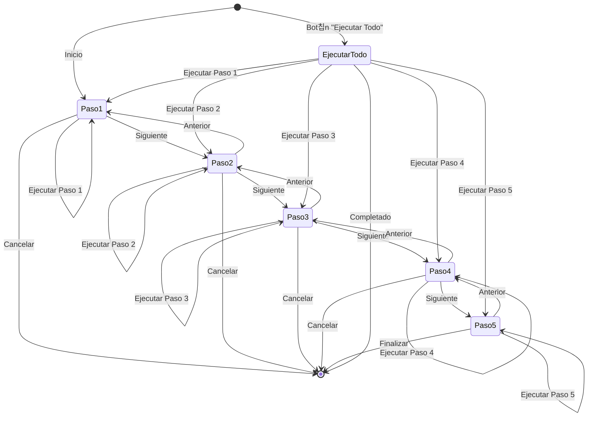
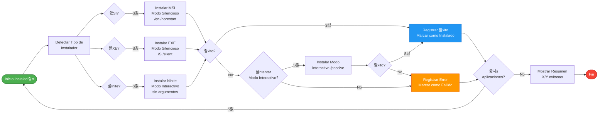

# 游댃 Diagrama de Flujo - MAB APP TECNOLOGIA

## 游늵 Flujo Principal de la Aplicaci칩n

```mermaid
flowchart TD
    Start([Inicio de la Aplicaci칩n]) --> CheckAdmin{쮼jecutando como<br/>Administrador?}
    CheckAdmin -->|No| ErrorAdmin[Mostrar Error:<br/>Se requieren permisos<br/>de Administrador]
    ErrorAdmin --> End([Fin])
    
    CheckAdmin -->|S칤| Init[Inicializar Aplicaci칩n]
    Init --> LoadData[Cargar Datos Iniciales]
    
    LoadData --> LoadConsorcios[Cargar Consorcios desde CSV]
    LoadData --> GetSystemInfo[Obtener Serial y Fabricante<br/>del Equipo]
    LoadData --> ScanSoftware[Escanear Carpeta Software<br/>para detectar aplicaciones]
    LoadData --> EnsureResources[Verificar/Copiar Recursos<br/>a C:\MAB-Resources]
    
    LoadConsorcios --> CheckData{쮻atos cargados<br/>correctamente?}
    GetSystemInfo --> CheckData
    ScanSoftware --> CheckData
    EnsureResources --> CheckData
    
    CheckData -->|Error| ShowError[Mostrar Error y<br/>Registrar en Log]
    ShowError --> End
    
    CheckData -->|OK| Step1[PASO 1: NOMENCLATURA]
    
    Step1 --> ShowStep1[Mostrar Interfaz Paso 1]
    ShowStep1 --> SelectConsorcio[Usuario selecciona Consorcio]
    SelectConsorcio --> SelectTipoEquipo[Usuario selecciona Tipo de Equipo]
    SelectTipoEquipo --> GenerateName[Generar Nombre de Equipo<br/>SIGLAS-XXXX / SIGLAS-RUB-XXXX / SIGLAS-HOME-XXXX]
    GenerateName --> ShowGeneratedName[Mostrar Nombre Generado]
    
    ShowGeneratedName --> ExecuteStep1{쮼jecutar<br/>Paso 1?}
    ExecuteStep1 -->|No| Navigate1{쯅avegar a<br/>otro paso?}
    Navigate1 -->|Siguiente| Step2
    Navigate1 -->|Anterior| Step1
    
    ExecuteStep1 -->|S칤| RenameComputer[Renombrar Equipo]
    RenameComputer --> CheckRename{Renombrado<br/>exitoso?}
    CheckRename -->|Error| LogError1[Registrar Error en Log]
    LogError1 --> ShowError1[Mostrar Error al Usuario]
    ShowError1 --> Step1
    
    CheckRename -->|칄xito| LogSuccess1[Registrar 칄xito en Log]
    LogSuccess1 --> Step2[PASO 2: GESTI칍N DE USUARIOS]
    
    Step2 --> ShowStep2[Mostrar Interfaz Paso 2]
    ShowStep2 --> ExecuteStep2{쮼jecutar<br/>Paso 2?}
    ExecuteStep2 -->|No| Navigate2{쯅avegar a<br/>otro paso?}
    Navigate2 -->|Siguiente| Step3
    Navigate2 -->|Anterior| Step1
    
    ExecuteStep2 -->|S칤| ConfigAdmin[Configurar Usuario ADMIN:<br/>- Renombrar usuario actual<br/>- Configurar contrase침a<br/>- Configurar PIN]
    ConfigAdmin --> CheckAdminConfig{쮺onfiguraci칩n<br/>exitosa?}
    CheckAdminConfig -->|Error| LogError2[Registrar Error]
    LogError2 --> ShowError2[Mostrar Error]
    ShowError2 --> Step2
    
    CheckAdminConfig -->|칄xito| CreateMAB[Crear Usuario MAB<br/>est치ndar sin contrase침a]
    CreateMAB --> CheckMAB{쯋suario MAB<br/>creado?}
    CheckMAB -->|Error| LogError2
    CheckMAB -->|칄xito| LogSuccess2[Registrar 칄xito]
    LogSuccess2 --> Step3[PASO 3: PERSONALIZACI칍N]
    
    Step3 --> ShowStep3[Mostrar Interfaz Paso 3]
    ShowStep3 --> ExecuteStep3{쮼jecutar<br/>Paso 3?}
    ExecuteStep3 -->|No| Navigate3{쯅avegar a<br/>otro paso?}
    Navigate3 -->|Siguiente| Step4
    Navigate3 -->|Anterior| Step2
    
    ExecuteStep3 -->|S칤| PersonalizeAdmin[Aplicar Personalizaci칩n ADMIN:<br/>- Fondo de pantalla<br/>- Pantalla de bloqueo<br/>- Imagen de perfil]
    PersonalizeAdmin --> PersonalizeMAB[Aplicar Personalizaci칩n MAB:<br/>- Fondo de pantalla<br/>- Pantalla de bloqueo<br/>- Imagen de perfil]
    PersonalizeMAB --> CheckPersonalization{쯇ersonalizaci칩n<br/>exitosa?}
    CheckPersonalization -->|Error Parcial| LogWarning3[Registrar Advertencia]
    LogWarning3 --> Step3
    CheckPersonalization -->|칄xito| LogSuccess3[Registrar 칄xito]
    LogSuccess3 --> Step4[PASO 4: INSTALACI칍N DE SOFTWARE]
    
    Step4 --> ShowStep4[Mostrar Interfaz Paso 4<br/>con Lista de Software Detectado]
    ShowStep4 --> SelectSoftware[Usuario selecciona<br/>aplicaciones a instalar]
    SelectSoftware --> ExecuteStep4{쮼jecutar<br/>Instalaci칩n?}
    ExecuteStep4 -->|No| Navigate4{쯅avegar a<br/>otro paso?}
    Navigate4 -->|Siguiente| Step5
    Navigate4 -->|Anterior| Step3
    
    ExecuteStep4 -->|S칤| InstallLoop[Para cada aplicaci칩n seleccionada:]
    InstallLoop --> DetectType{쯊ipo de<br/>instalador?}
    DetectType -->|MSI| InstallMSI[Instalar MSI modo silencioso]
    DetectType -->|EXE| InstallEXE[Instalar EXE modo silencioso]
    DetectType -->|Ninite| InstallNinite[Instalar Ninite modo interactivo]
    
    InstallMSI --> CheckInstall{쯀nstalaci칩n<br/>exitosa?}
    InstallEXE --> CheckInstall
    InstallNinite --> CheckInstall
    
    CheckInstall -->|Error| TryInteractive{쯀ntentar modo<br/>interactivo?}
    TryInteractive -->|S칤| InstallInteractive[Instalar modo interactivo]
    InstallInteractive --> CheckInstall
    TryInteractive -->|No| LogInstallError[Registrar Error]
    LogInstallError --> NextApp{쯄치s<br/>aplicaciones?}
    
    CheckInstall -->|칄xito| LogInstallSuccess[Registrar 칄xito]
    LogInstallSuccess --> NextApp
    
    NextApp -->|S칤| InstallLoop
    NextApp -->|No| ShowInstallSummary[Mostrar Resumen:<br/>X/Y instalaciones exitosas]
    ShowInstallSummary --> Step5[PASO 5: OPTIMIZACI칍N]
    
    Step5 --> ShowStep5[Mostrar Interfaz Paso 5<br/>con Opciones de Optimizaci칩n]
    ShowStep5 --> SelectOptimizations[Usuario selecciona<br/>m칩dulos de optimizaci칩n]
    SelectOptimizations --> ExecuteStep5{쮼jecutar<br/>Optimizaciones?}
    ExecuteStep5 -->|No| Navigate5{쯅avegar a<br/>otro paso?}
    Navigate5 -->|Anterior| Step4
    Navigate5 -->|Ejecutar Todo| ExecuteAll
    
    ExecuteStep5 -->|S칤| CleanDesktop[Limpiar Iconos del Escritorio]
    CleanDesktop --> CleanTaskbar[Limpiar Barra de Tareas<br/>ADMIN y MAB]
    CleanTaskbar --> CheckOpt1{쯇rivacidad<br/>habilitada?}
    
    CheckOpt1 -->|S칤| OptPrivacy[Aplicar Optimizaciones<br/>de Privacidad]
    CheckOpt1 -->|No| CheckOpt2
    OptPrivacy --> CheckOpt2{Rendimiento<br/>habilitado?}
    
    CheckOpt2 -->|S칤| OptPerformance[Aplicar Optimizaciones<br/>de Rendimiento]
    CheckOpt2 -->|No| CheckOpt3
    OptPerformance --> CheckOpt3{쯊elemetr칤a<br/>habilitada?}
    
    CheckOpt3 -->|S칤| DisableTelemetry[Deshabilitar Servicios<br/>de Telemetr칤a]
    CheckOpt3 -->|No| CheckOpt4
    DisableTelemetry --> CheckOpt4{쯋X<br/>habilitada?}
    
    CheckOpt4 -->|S칤| OptUX[Aplicar Optimizaciones<br/>de Experiencia de Usuario]
    CheckOpt4 -->|No| CheckOpt5
    OptUX --> CheckOpt5{쮹loatware<br/>habilitado?}
    
    CheckOpt5 -->|S칤| RemoveBloatware[Eliminar Aplicaciones<br/>No Deseadas]
    CheckOpt5 -->|No| CheckOpt6
    RemoveBloatware --> CheckOpt6{쯀nicio<br/>habilitado?}
    
    CheckOpt6 -->|S칤| OptStartup[Optimizar Inicio<br/>del Sistema]
    CheckOpt6 -->|No| CheckOpt7
    OptStartup --> CheckOpt7{쯃impieza<br/>habilitada?}
    
    CheckOpt7 -->|S칤| CleanTemp[Limpiar Archivos<br/>Temporales]
    CheckOpt7 -->|No| CheckOpt8
    CleanTemp --> CheckOpt8{쯆ptimizador<br/>Avanzado habilitado?}
    
    CheckOpt8 -->|S칤| RunAdvancedOptimizer[Ejecutar OptimizerMAB.ps1<br/>Script Avanzado]
    CheckOpt8 -->|No| LogOptSuccess
    RunAdvancedOptimizer --> LogOptSuccess[Registrar 칄xito de<br/>Optimizaciones]
    LogOptSuccess --> ShowOptSummary[Mostrar Resumen:<br/>X/Y optimizaciones exitosas]
    ShowOptSummary --> CheckExecuteAll{쮽ue ejecuci칩n<br/>de "Ejecutar Todo"?}
    
    CheckExecuteAll -->|No| End
    CheckExecuteAll -->|S칤| ShowFinalMessage
    
    ExecuteAll[Ejecutar Todos los Pasos<br/>Autom치ticamente] --> Step1
    ExecuteAll --> ProgressBar[Actualizar Barra de Progreso<br/>Global]
    ProgressBar --> Step1
    
    ShowFinalMessage[Mostrar Mensaje Final:<br/>Configuraci칩n Completa<br/>Recomendar Reinicio] --> End
    
    style Start fill:#4CAF50,stroke:#2E7D32,color:#fff
    style End fill:#F44336,stroke:#C62828,color:#fff
    style Step1 fill:#2196F3,stroke:#1565C0,color:#fff
    style Step2 fill:#2196F3,stroke:#1565C0,color:#fff
    style Step3 fill:#2196F3,stroke:#1565C0,color:#fff
    style Step4 fill:#2196F3,stroke:#1565C0,color:#fff
    style Step5 fill:#2196F3,stroke:#1565C0,color:#fff
    style ErrorAdmin fill:#FF9800,stroke:#E65100,color:#fff
    style ShowError fill:#FF9800,stroke:#E65100,color:#fff
    style ExecuteAll fill:#9C27B0,stroke:#6A1B9A,color:#fff
```

---

## 游 Flujo de Navegaci칩n entre Pasos



---

## 游댃 Flujo de Instalaci칩n de Software



---

## 游꿢 Flujo de Optimizaci칩n del Sistema


---

## 游닇 Leyenda

### Colores en los Diagramas
- 游릭 **Verde**: Inicio/Fin exitoso
- 游댮 **Rojo**: Fin/Error
- 游댯 **Azul**: Pasos principales
- 游 **Naranja**: Advertencias/Errores
- 游릮 **Morado**: Operaciones especiales

### S칤mbolos
- **Diamante**: Decisi칩n/Condicional
- **Rect치ngulo**: Proceso/Operaci칩n
- **Cilindro**: Almacenamiento/Log
- **Rombo con bordes**: Verificaci칩n/Validaci칩n

---

## 游댌 Puntos de Decisi칩n Clave

1. **Verificaci칩n de Administrador**: Bloquea ejecuci칩n si no hay permisos
2. **Carga de Datos**: Valida que todos los recursos est칠n disponibles
3. **Ejecuci칩n de Pasos**: Permite ejecutar individual o todos juntos
4. **Instalaci칩n de Software**: Intenta silencioso primero, luego interactivo
5. **Optimizaciones**: Cada m칩dulo es opcional e independiente

---

## 游닄 Referencias

- [HISTORIA_USUARIO.md](HISTORIA_USUARIO.md) - Historia de usuario completa
- [GUIA_RAPIDA.md](GUIA_RAPIDA.md) - Gu칤a de uso paso a paso
- [README.md](README.md) - Documentaci칩n principal

---

**Versi칩n**: 1.0.0  
**칔ltima actualizaci칩n**: Noviembre 2025  
**Formato**: Mermaid Diagram (compatible con GitHub, GitLab, y editores Markdown)

